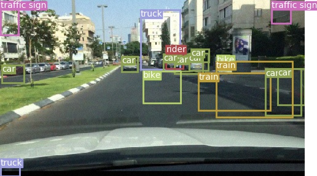
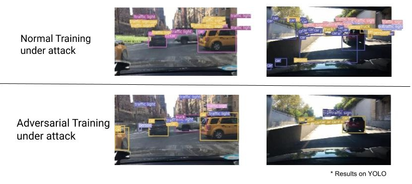
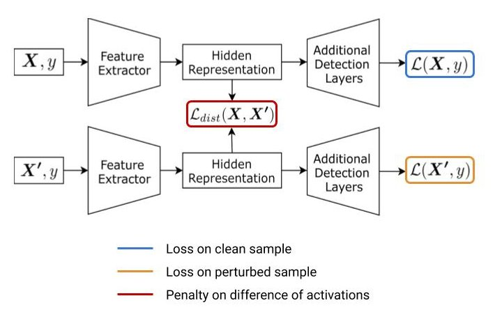

# Project 3: Robust Intermediate Representations

Neural networks in general are vulnerable to perturbations, which can be naturally occurring or adversarially generated. In context of autonomous driving these perturbations can have a significant impact on the performance of an object detector. We want to assess this impact and make the object detector robust to these perturbations.

We use the [Berkeley Deep Drive dataset](https://bdd-data.berkeley.edu/) and compare our work on two single shot object detectors: Yolov3 and Retinanet. Next we measure the robustness performance with two different methods: Adversarial training and IRL

#### Code Structure
```
src
|__ code
    |_ YOLOv3
    |_ retinanet
    |_ DSSD
    |_ shared
        |_ attacks
        |_ evaluate
        |_ representation_learning
```

#### Object Detectors

This repository has implementations of the following three object detectors in PyTorch:

1. [YOLOv3](https://arxiv.org/abs/1804.02767)
2. [Retinanet](https://arxiv.org/abs/1708.02002)
3. [DSSD](https://arxiv.org/abs/1701.06659)

It uses the Berkeley Deep Drive dataset.

#### Perturbations

The following three perturbations have been implemented in the attacks module:
1. Random Noise  ```generate_noisy_image(images, noise)```
2. FGSM  ```generate_fgsm_image(model, images, targets, epsilon, model_type)```
3. PGD  ```generate_pgd_image(model, images, targets, alpha, epsilon, iterations, model_type)```

detection on clean image:


detection on FGSM attacked image:



detection on PGD attacked image:


#### Robustness training

The following two robustness improving techniques have been implemented: 
##### 1. Adversarial Training


Results of Adversarial Training:



```sh
    cd src
    # For Retinanet:
    python code/retinanet/train.py --attack_type FGSM --eps 4
    # For YOLOv3:
    python code/YOLOv3/train.py --epochs 50 --training_type Adversarial --attack_type FGSM -- eps 2 
```
##### 2. Invariant Representation Learning


```sh
    cd src
    # For Retinanet:
    python code/retinanet/train.py --epochs 30 --irl 1 --irl_noise_type random_noise --irl_alpha 0.8 --irl_beta 0.2 --irl_gamma 0.1 --irl_loss_type 8 --eps 16
    # For YOLOv3:
    python code/YOLOv3/train.py --epochs 50 --training_type IRL --attack_type FGSM --eps 2 --irl_loss_type 6 --irl_alpha 0.5 --irl_beta 0.5 --irl_gamma 1.0
```

